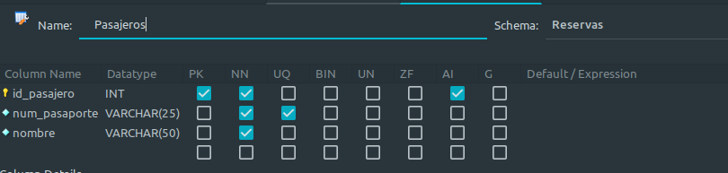

# Definición de datos en MySQL
## Introducción
En este ejercicio veremos como crear tablas , atributos de diferentes tipos, restricciones, agregar claves primarias, foraneas y  tambien vamos a explorar el sistema de gestion de base de datos.
Responderemos diferentes preguntas y explicaremos porque crearemos 3 tablas, porque cada restricción, etc.

[Link Gitlab](https://gitlab.com/solblaze03/base-de-datos/-/tree/main/Definicion_datos?ref_type=heads)

Autor. Maicol Barragán Pérez.

## Creación Base de datos
Con este comando Creamos la base de datos `Reservas` y con el comando `use` nos centraremos en la base de datos que queramos, en este caso `Reservas`.
La podemos crear con mysql workbench de la siguiente manera, en la parte superior en el logo ->
 seleccionamos y colocaremos el nombre de nuestra base de datos donde dice create Schema y le damos a aplicar.
```sql
CREATE DATABASE Reservas;
USE `Reservas`;
```
## Creación tablas
Seleccionaremos la base de datos y seleccionamos esta opcion en la parte superior en el logo ->   nos saldra una ventana donde esta el name de la tabla , column name,datatype y las restricciones, que son la primary key, not null , unique ,etc. 
Colocaremos los nombres de la columnas como por ejemplo id_pasajero con sus restricciones, quedadando de esta manera.


Tambien lo podemos hacer de la siguiente manera.

Con el comando `CREATE TABLE` crearemos la tabla con el nombre `Pasajeros` y en la tabla le asignamos unos atributos.
- `id_pasajero` sera un numero entero no nulo, al insertar no debe contener un numero nulo y se auto incrementara cada vez que insertemos un registro, también sera la clave primaria de nuestra tabla con el que identificaremos al pasajero.
- `num_pasaporte` sera varchar que va contener una longitud de 9 caracteres, debe requerido al insertar y sera único, no habrá repetidos.
- `nombre` sera varchar con una longitud de caracteres de 50, para adaptarse a diferentes nombres que existan, y sera necesario al insertarlo.
```sql
CREATE TABLE `Pasajeros` (
`id_pasajero` int NOT NULL AUTO_INCREMENT UNIQUE,
`num_pasaporte` varchar(9) NOT NULL UNIQUE,
`nombre` varchar(50) NOT NULL,
PRIMARY KEY (`id_pasajero`),
);
```
Crearemos la tabla `Vuelos` con los atributos:
- `id_vuelo` que sera la clave primaria y cada vez que hagamos un registro se incrementara el `id_vuelo`.
- `origen` : En esta columna se exigirá el origen del vuelo que no debe ser nulo.
- `destino` : En esta columna se elige el mismo tipo de dato y restricciones que en origen.
- `fecha`: Aquí el tipo de dato sera `Date` y se exigirá no ser nulo.
- `Capacidad` : Tendrá el tipo dato `int` y sera no nulo.
```sql
CREATE TABLE `Vuelos` (
`id_vuelo` int(8) NOT NULL AUTO_INCREMENT,
`origen` varchar(25) NOT NULL,
`destino` varchar(25) NOT NULL,
`fecha` date NOT NULL,
`capacidad` int NOT NULL,
PRIMARY KEY (`id_vuelo`)
);
```

Esta es la ultima tabla y tendrá el nombre de `Vuelos_Pasajeros`, tendrá estos atributos:

- `id_vuelo` y `id_pasajero` son las claves foráneas que relacionan a la tabla `Pasajeros` y `Vuelos`, creamos los atributos y luego la seleccionamos con `FOREIGN KEY(Atributo)` y referenciamos a la otra tabla con `REFERENCES` luego el nombre de la tabla y elegimos el atributo de la tabla referenciada.

- `num_asiento` sera el numero de asiento que elegirá el pasajero,como solo un pasajero solo puede usar una plaza deberá ser única, para evitar que existan asientos repetidos se colocara el `UNIQUE`.

- Crearemos el atributo `id_vuelospasajeros` que sera la clave primaria, se auto incrementara, esto sera util para luego cancelar la reserva con su id.

```sql
CREATE TABLE `Vuelos_Pasajeros` (
`id_vuelo` int NOT NULL ,
`id_pasajero` int NOT NULL,
`num_asiento` int NOT NULL UNIQUE,
`id_vuelospasajeros` int unsigned NOT NULL AUTO_INCREMENT PRIMARY KEY,
FOREIGN KEY (`id_vuelo`) REFERENCES `Vuelos` (`id_vuelo`),
FOREIGN KEY (`id_pasajero`) REFERENCES `Pasajeros` (`id_pasajero`)
);
```
Crearemos las tres tablas por que pediremos los datos del pasajero , luego daremos de alta el vuelo que tendra un numero de asientos asignados y Vuelos_Pasajeros que usaremos para relacionar las dos tablas, tambien cuando el usuario haya elegido el asiento haremos un registro con el id_vuelo, id_pasajero y el numero de asiento del pasajero.
Es necesario `el id_vuelospasajeros` ya que no podremos cancelar el vuelo a través de sus claves foráneas.
Las restricciones mas útiles para este ejercicio fue la de `UNIQUE` ya que evitaremos de que haya registros repetidos, como el DNI por ejemplo que es unico, si quisiéramos que por ejemplo un numero de asiento no sea negativo se usaría `UNSIGNED` ya que no permite que exista números negativos. y si quisiéramos mas restricciones se usaría los triggers o con otros lenguajes de programación evitando que se introduzca datos no deseados.
