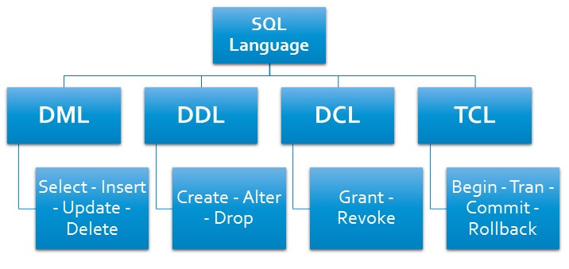

# Unidad C0: Recapitulación

Autor. Maicol Barragán Peréz

Introducción (sobre el documento o el tema tratado) -- mejor escribirla al final.

## Concepto y origen de las bases de datos
¿Qué son las bases de datos? ¿Qué problemas tratan de resolver? Definición de base de datos.

Las bases de datos es un cojunto estructurado que representa entidades y sus interrelaciones. Este cojunto estructurado de datos debe poder ser utilizada de forma compartida por muchos usuarios de distintos tipos.

Las bases de datos pueden tener entidades de distinto tipo y no se limita a una entidad como los ficheros, pueden relacionar los ficheros permitiendo un acceso mas eficiente a la informacion relacionada, minimizan la rebundancia de datos y puede ser compartida por muchos usuarios de distinto tipo.

## Sistemas de gestión de bases de datos
¿Qué es un sistema de gestión de bases de datos (DBMS)? ¿Qué características de acceso a los datos debería proporcionar? Definición de DBMS.

Un sistema de gestión de base de datos permite  administrar y organizar grandes volumenes de información, permitiendo el almacenamiento eficiente, la recuperación de datos y manipulacion de informacion de manera segura.

Un sistema de gestion de base de datos debe proporcionar:
- Consultas no predefinidas y complejas
- Flexibilidad e independencia
- Problemas de la rebundancia
- Integridad de los datos
- Concurrencia de datos
- Seguridad

### Ejemplos de sistemas de gestión de bases de datos
¿Qué DBMS se usan a día de hoy? ¿Cuáles de ellos son software libre? ¿Cuáles de ellos siguen el modelo cliente-servidor?
* Oracle DB
* IMB Db2
* SQLite
* MariaDB
* SQL Server
* PostgreSQL
* mySQL

Actualmente las bases de datos mas utilizadas son Mysql,postgreSQL, SQLite, Mongodb y SQL server.

Las bases de datos que son software libre son mySQL, SQLite, MariaDB y postgreSQL.

El unico que no sigue el modelo cliente servidor es SQLite y se utiliza directamente desde la aplicación cliente.

## Modelo cliente-servidor
¿Por qué es interesante que el DBMS se encuentre en un servidor? ¿Qué ventajas tiene desacoplar al DBMS del cliente? ¿En qué se basa el modelo cliente-servidor?

Tener el DBMS en un servidor tiene las ventajas de aacceder en remoto, suelen tener medidas de seguridad mas robustas, tener respaldo y reuperación, facilitar las tareas de mantenimiento, colaboración eficiente y disponibilidad continua.

El modelo cliente servidor esun modelo de comunicación que permite la distribución de tareas dentro de una red de ordenadores

* __Cliente__: Es un dispositivo o programa que solicia servicios o recursos o recursos a un servidor
* __Servidor__: Es un dispositivo o programa que proporciona servicios o recursos a los clientes.
* __Red__: es la infraestructura de comunicación que conecta el cliente y el servidor, puede ser una red local o una red mas extensa.
* __Puerto de escucha__: Es un numero de identificación asignado a un programa en el servidor que permite a los clientes conectarse y comunicarse con él, por ejemplo el 3306 de mysql.
* __Petición__: Acción realizada por el cliente en respuesta a una peticiion.
* __Respuesta__: Es la informacion devuelta por el servidor al clienteen respuesta a una peticion.

## SQL
¿Qué es SQL? ¿Qué tipo de lenguaje es?

SQL (Structured Query Language) es un lenguaje de programación que se utiliza para el manejo de bases de datos relacionales.
Es una herramienta para poder acceder, manipular y consultar la informacion de una base de datos.

### Instrucciones de SQL
#### DDL
- Create: Para crear objetos en la base de datos
- Alter : Altera la estructura de la base de datos
- Drop: Elimina los objetos de la base de datos
- Truncate: Elimina todos los registros de una tabla
- Comment: Agregar comentarios al _Diccionario de datos.
- Rename: Cambiar  el nombre de un objeto
#### DML
- Select: Recuperar datos de la base de datos.
- Insert: Insertar datos en la tabla.
- Update: Actualizaciones de datos existentes en una tabla.
- Delete: Elimina todos los registros de una tabla.
#### DCL
- Grant: Permite dar permisos a uno o varios usuarios 
- Revoke: Permite eliminar permisos que previamente se han concedido con GRANT.
#### TCL
- Commit: Guarda el trabajo realizado.
- Savepoint: Identifica un punto de una transacción.
- Rollback: Restaurar la base de datos a la original.
- Set Transaction: Cambia las opciones de la transacción como nivel de aislamiento y que segmento de cancelación utiliza.
## Bases de datos relacionales
¿Qué es una base de datos relacional? ¿Qué ventajas tiene? ¿Qué elementos la conforman?

Una base de datos relacional organiza los datos en filas y columnas, que en cojunto forman una tabla. Los datos normalmente se estructuran en varias tablas que se pueden unir atraves de unas clave principal o una clave externa.

Las ventajas que tiene son:
1. Evita la duplicidad de registros
2. Garantiza la integridad referencial.
3. Elimina la duplicaciones de registros
4. Favorece la normalización.

Esta representada por entidades, atributos y relaciones.

* __Relación (tabla)__: Las relaciones se guardan en formato tabla, se almacena junto a las entidades.
* __Atributo/Campo (columna)__: Corresponde a una columna de la tabla, los atributos son las propiedades que definen una relación
* __Registro/Tupla (fila)__: Es la unica fila de una tabla que contiene un unico registro

## Fuentes

- [Introduccion base de datos - Rafael Camps Paré](https://www.uoc.edu/pdf/masters/oficiales/img/913.pdf)
- [Centro de formación tecnica para la industria](https://www.cursosaula21.com/que-es-sql/)
- [TecnoBits - Sebastian Vidal](https://tecnobits.com/que-es-un-sistema-de-gestion-de-bases-de-datos-sgbd/)
- [Ciberninjas - Pablo Álvarez](https://ciberninjas.com/software-bases-datos-codigo-abierto/)
- [Learn SQL - Kamila Ostrowska](https://learnsql.es/blog/las-bases-de-datos-mas-populares-en-2023/#:~:text=Comparaci%C3%B3n%20de%20las%205%20principales%20bases%20de%20datos,Microsoft%20SQL%20Server%20...%205%205.%20MongoDB%20)
- [mtro Frenando Arciniega](https://fernandoarciniega.com/sentencias-sql-ddl-dml-dcl-y-tcl/#:~:text=SENTENCIAS%20SQL%20%28DDL%2C%20DML%2C%20DCL%20Y%20TCL%29%20En,uno%20de%20ellos%20y%20en%20qu%C3%A9%20se%20diferencian%3A)
- [Sistemas](https://sistemas.com/red-cliente-servidor.php)
- [IONOS](https://www.ionos.mx/digitalguide/servidores/know-how/modelo-cliente-servidor/)
- [IBM](https://www.ibm.com/mx-es/topics/relational-databases)